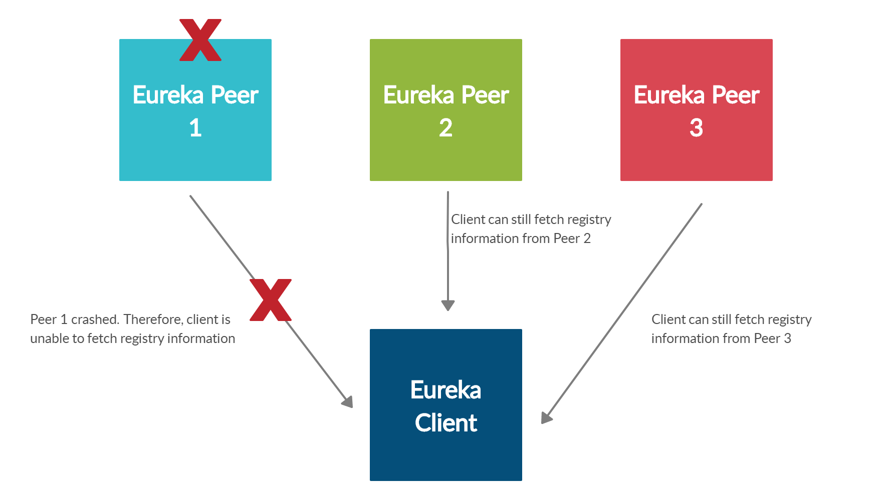

# TECHCOMBACK INTERVIEW

This is a Java / Maven / Spring Boot application.

## DESIGN
The application is built on top of spring boot architecture, consist:
- Controller: Handles the HTTP requests, translates the JSON parameter to object
- Service: Handles all the business logic
- Exception: Handles exception

For simplicity, I used **HashMap** instead of database to storage. It is initialized at `com/tech/interview/storage/PoolStorage.java`

### Calculate quantile
To calculate quantile value I use nearest-rank algorithm( [https://en.wikipedia.org/wiki/Percentile#Worked_examples_of_the_nearest-rank_method
](https://en.wikipedia.org/wiki/Percentile#Worked_examples_of_the_nearest-rank_method))

#### Implement nearest-rank algorithm
Assume the number of request query will be significantly more than the number of request update pool!\
Since the condition is assumed, when the pool is INSERT or APPEND I will sort the poolValues in ascending order.\
So with nearest-rank algorithm \
N: the total count of elements in the pool\
i: rank corresponding to the percentile value

Because poolValues is sorted, 'i' is the index in the array

## HOW TO RUN

- Make sure you are using JDK 1.8
- You can build the project and run the tests by running `./mvnw clean package`
- Once successfully built, you can run the service by running `./mvnw spring-boot:run`

Once the application runs you should see something like this

## Test endpoints with swagger

Using swagger for test endpoints: [http://localhost:8080/swagger-ui.html](http://localhost:8080/swagger-ui.html)

## HA-SCALABILITY
High Availability: High availability is when your apps remain available and accessible without any interruption and serve their intended function seamlessly. \
Scalability: Scalability simply refers to the ability of an application or a system to handle a huge volume of workload or expand in response to an increased demand.

To solve the problem on enhancing the high availability and scalability of this case, I propose 2 ways to implement:
- Container Architecture (Spring + Docker): 
  - Use docker to containerize services
  - Deploy spring cloud eureka server with peer awareness configuration

- Serverless Architecture (AWS): 
  - Use API Gateway to create and manage Rest API
  - API Gateway integration with Lambda Function to perform insert, append or query **pool** data stored on DynamoDB

--> Each architecture will respond to different circumstances. Container Architecture is suitable if you need to strictly manage resources or deploy on an on-premise environment. As for Serverless Architecture, the management will be managed by AWS, so just focus on the business development side.

